<div align="center">

# 👋 Hey there, I'm **Amin Mohamed**

### 💻 Full-Stack Web Developer | Laravel Specialist | Problem Solver


[](https://linkedin.com/in/your-profile)
[](https://your-portfolio.com)
[](mailto:your.email@example.com)

</div>

---

## 🚀 About Me

```typescript
const amin = {
    location: "Morocco 🇲🇦",
    currentFocus: ["Laravel", "TypeScript", "Full-Stack Development"],
    learning: ["Advanced Laravel Patterns", "RESTful API Design", "System Architecture"],
    openTo: ["Remote Work", "Freelance Projects", "Open Source Collaboration"],
    motto: "Code with purpose, build with passion ✨"
};
```


### 🎯 What I Do

- 🏗️ Build **scalable web applications** with modern frameworks
- 🎨 Create **intuitive user experiences** with clean, responsive design
- ⚡ Optimize **performance** and write **maintainable code**
- 🔧 Develop **RESTful APIs** and integrate third-party services
- 📚 Continuously learn and apply **best practices**

---

## 🛠️ Tech Stack

### **Frontend**


### **Backend**


### **Tools & Platforms**


---

## 🏆 Featured Projects

<div align="center">

### 🏠 [Unihousing](https://github.com/your-username/unihousing)
**Student Housing Platform**

  

A comprehensive web platform connecting students with apartment owners, featuring authentication, property listings, advanced search, and booking management system.

**🎯 Key Features:** User Authentication • Property Listings • Search & Filters • Booking System • Admin Dashboard

---

### 🌴 [EasyTourBooking](https://github.com/your-username/easytourbooking)
**Travel Booking Management System**

  

A dynamic travel booking application with complete CRUD operations, dynamic page generation, and administrative controls for managing tours and reservations.

**🎯 Key Features:** CRUD Operations • Dynamic Pages • Admin Dashboard • Booking Management

---

### 🛒 [Enjoy Market](https://github.com/your-username/enjoy-market)
**Complete eCommerce Solution**

  

A full-featured eCommerce platform with product management, shopping cart functionality, secure user authentication, and comprehensive admin panel.

**🎯 Key Features:** Product Management • Shopping Cart • Payment Integration • User Auth • Admin Panel • Order Tracking

</div>

---

## 📊 GitHub Stats

<div align="center">
  
  
</div>

<div align="center">
  
</div>

---

## 🔄 My Development Workflow

```mermaid
graph LR
    A[📋 Plan] --> B[🎨 Design]
    B --> C[⚙️ Develop]
    C --> D[🔗 Integrate]
    D --> E[✅ Test]
    E --> F[🚀 Deploy]
    F --> G[📈 Monitor]
    G --> A
```



---

## 🚀 Laravel Quick Start Guide

```bash
# Clone the repository
git clone https://github.com/your-username/your-project.git
cd your-project

# Install dependencies
composer install
npm install && npm run build

# Environment setup
cp .env.example .env
php artisan key:generate

# Database configuration
# Edit your .env file with database credentials, then:
php artisan migrate --seed

# Start development server
php artisan serve

# Your application is now running at http://localhost:8000
```

---

## 💡 Fun Facts

- 🌙 I code best during night hours
- ☕ Fueled by coffee and curiosity
- 🎯 Always exploring new technologies
- 🤝 Love collaborating on innovative projects
- 📚 Continuous learner and tech enthusiast

---

## 📫 Let's Connect!

<div align="center">

**Open to collaborations, freelance opportunities, and interesting projects!**

[](https://linkedin.com/in/your-profile)
[](https://twitter.com/your-profile)
[](https://your-portfolio.com)
[](mailto:your.email@example.com)

---


### ⭐️ From [Amin Mohamed](https://github.com/your-username) | Built with 💙

</div>
